# Lab 1: Hashing and Blockchain

## 1.1. Introduction
There are many fundamental concepts in cryptography and cybersecurity, hashing and blockchain are among one of those. In this lab, we will explore the concept of hashing and blockchain and their applications. We will start with hashing.

## 1.2. Hashing
Hashing is a process of mapping data of arbitrary size to data of fixed size. The output of a hash function is called a hash value, hash code, hash sum, or simply hash. Hashing is used in many applications, such as password storage, digital signatures, and blockchain. Hash functions have the properties of being quick, irreversible, and collision free (i.e., no two messages will end up with the same hash value). 

### 1.2.1. Hashing Algorithms
There are many different hashing algorithms used in practice, such as MD5, SHA-1, SHA-2, and SHA-3. We will experiment with some of those algorithms in this lab. For this, we will use the Kali Linux VM. You should have openssl already on your VM, check by typing `openssl` in the terminal. If not, you can install it by typing `sudo apt install openssl`. If properly installed, you should see something like below when you type in `openssl help` in the terminal:

<figure>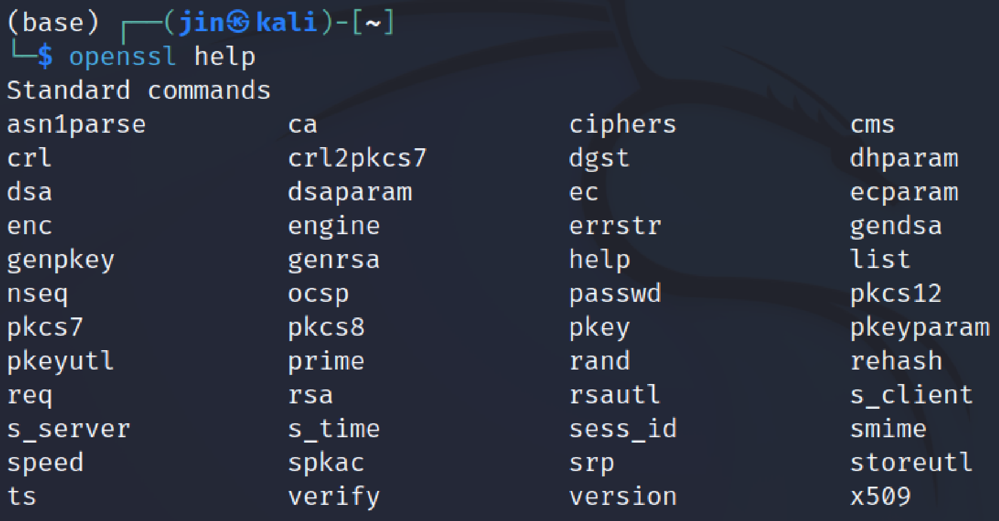<figcaption></figcaption></figure>

To use hashing algorithms, we will use the digest command in openssl:

    openssl dgst -[hashing algorithm] [file]


For example, to hash the file `test.txt` using MD5, type:
    
    openssl dgst -md5 test.txt


It will look something like below:

<figure>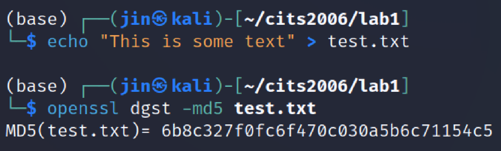<figcaption></figcaption></figure>

You can hash texts without creating the file by piping the text to openssl:

<figure>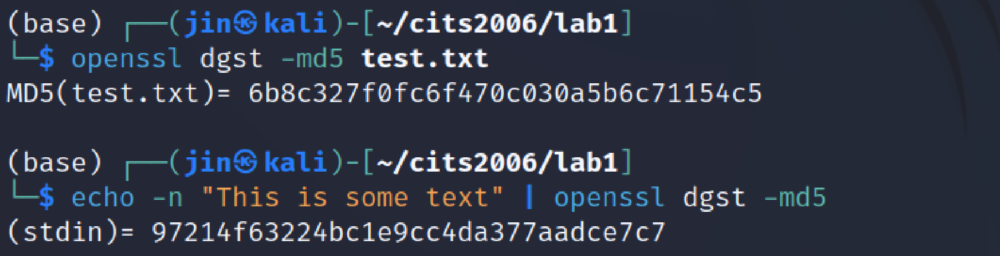<figcaption></figcaption></figure>

You will notice that the hash values are different, because the hash of the file includes the file headers and other information associated with the file, whereas the hash of the text does not include such information.

Voila! This is how simple it is to generate hash values of files and texts!

### 1.2.2. Keyed hash and HMAC
You can also hash a file using a key. This is called a keyed hash. To do this, you can use the `-hmac` option in openssl:

    openssl dgst -[hashing algorithm] -hmac [key] [file]

<figure>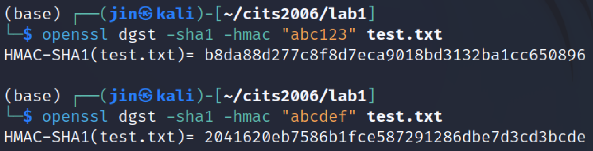<figcaption></figcaption></figure>

You can see from the above image, that the hash value would be different if the key is incorrect. This is useful for verifying the integrity of the file sent from someone - the sender could generate a hash value using a shared secret key, so when the file needs to be verified, the receiver could use the same secret key to verify that the same hash value is generated. If they are not the same hash value, then the receiver knows that the file is different to what the sender has sent. It is also near impossible to tamper the generated hash value without knowing the secret key, so the integrity of the file can be guaranteed with high confidence.

#### TASK 1 Experiment with different keys
Try to use different keys to generate the hash value of the same file. Then, change something from the original file and try to generate the same hash value (by guessing a new key) that matches the original hash value. Discuss your observation with your peers and/or the lab facilitator.

Question: Is there any requirement for the key to be used for keyed hashing? (Some research should be conducted to see what happens to the key!)

### 1.2.3. Properties of one-way hash functions
To understand the properties of one-way hash functions, we will setup an experiment to conduct. 

1. Hash the text "This is a hash message" and generate the hashvalue H1 using a specific hash algorithm (e.g., MD5, SHA256).
2. Hash the text "This ir a hash message" and generate the hashvalue H2 using the same hash algorithm. Note that a letter 's' has been changed to 'r'.
3. Observe whether H1 and H2 (both should be saved onto files) are similar or not. You should write a simple program to compare how many bits are the same between H1 and H2.

#### TASK 2 Write the program to compare the hash values
Write a program to compare the hash values H1 and H2. The program should compare the hash values byte by byte and count how many bytes are the same. Discuss your observation with your peers and/or the lab facilitator.

(optional) Examine the number of bits that are different between H1 and H2 by writing a code for bit comparions.


### 1.2.4. One-way vs. collision-free properties
One-way hash functions are not necessarily collision-free. Collision-free means that it is impossible to find two different messages that have the same hash value. However, one-way hash functions are designed to be computationally infeasible to find a message that has a specific hash value. This means that it is possible to find two different messages that have the same hash value, but it is computationally infeasible to find such messages.

You are given a oneway.py file:

```
wget https://github.com/uwacyber/cits2006/raw/2024/cits2006-labs/files/oneway.py
```

Open and inspect the code. It tests a one-way property of hash functions. It currently implements MD5, but you can easily replace that with other hash functions to test. 

#### TASK 3 Implement Collision-free property checking code
Similar to the one-way property checking code provided above, you can check the collision-free property of hash functions. You may use the template collisionfree.py:

```
wget https://github.com/uwacyber/cits2006/raw/2024/cits2006-labs/files/collisionfree.py
```

Complete the code and examine the collision-free property of various hash functions.


<b>Question:</b> Which property is easier to break using bruteforce attack? Conduct a scientific experiments to prove your point. Discuss with your peers and/or the lab facilitator.


Based on the findings above, it should be clear that it is nearly impossible to break modern hash functions using bruteforce atttacks. Many of the cybersecurity concepts, methods and approaches rely on cryptographic properties such as above in order to provide security guarantees.

## 1.3. Blockchain
Now we will look at blockchain, which is a distributed ledger technology that is used in many applications, such as cryptocurrencies (e.g., Bitcoin, Ethereum), smart contracts, and supply chain management. Blockchain is an example of using hash functions as its primitive building blocks to create an architecture that can be useful in practice with cryptographic properties to guarantee the security. Blockchain is a chain of blocks that contain data. Each block contains a hash value of the previous block, so it is impossible to modify the data in the previous block without changing the hash value. This is because the hash value of the previous block is used to generate the hash value of the current block. So now we understand a bit more about blockchain, let's have a look at how it works in practice.

### 1.3.1. Blockchain files
You are given the almost complete code already, which you will complete the rest as part of this lab:

```
wget https://github.com/uwacyber/cits2006/raw/2024/cits2006-labs/files/blockchain.py
```

And you will need this for creating new transactions later:

```
wget https://github.com/uwacyber/cits2006/raw/2024/cits2006-labs/files/blockchain_transaction.py
```

If you inspect the code, it has three attributes:
1. current_transactions: the list of current transactions that are pending to be added to the blockchain.
2. chain: the list of transactions that have been added to the blockchain.
3. ndoes: the list of nodes in the blockchain network.

Now let's look at the methods.

#### 1.3.2. Adding a new transaction
The `new_transaction()` method is provided for you that adds a new transaction. This method will take three input parameters: sender, recipient and amount. Once a transaction has been added, the method returns the index of the block, specifying the next one to be mined (i.e., where the next transaction will be stored). Complete the code for `new_transaction()` method. It will append a dictionary into the `current_transactions` list. Note, the values are passed to the method already so you just have to use them.

#### TASK 4 Complete the new_transaction method
Complete the `new_transaction` method. You can test this by running the code and adding a new transaction manually.

#### 1.3.3. The new block
The initial block without the predecessor, which is called the genesis block, is created when the Blockchain is instantiated. Just like every other blocks, the genesis block also needs to have a “proof”. Proof is simply specifying the work done to mine the block. This will be discussed later in the mining section. Three methods work to create a new block: `new_block`, `new_transaction` and `hash`. For convenience, this has already been implemented for you.

#### 1.3.4. Proof of work
To create or mine new blocks for the Blockchain, a Proof of Work algorithm (PoW) is required. In simple terms, PoW is a number that solves a difficult mathematical problem. Normally, solving this is difficult, but verifying the solution is quick by anyone in the blockchain network. This is done using hashing algorithms. For example, we would like to find a hash given value `x`, such that the last digit of the `hash(x * y)` is 0 (e.g., hash(x*y) = ac23dc...0). Let’s assume the value `x=5`, and we are using the SHA256 hash algorithm. You can easily write this in Python.


```python
from hashlib import sha256
x = 5
y = 0  # start from 0
while sha256(str(x*y).encode()).hexdigest()[-1] != "0":
    y += 1
print('solution value is {}'.format(y))
```

The PoW algorithm used by Bitcoin is called Hashcash, which is essentially the same idea as above, but much more difficult (e.g., instead of one 0 at the end, has to have four or more 0’s at the beginning of the hash). Miners use this algorithm in order to create a block, and when they do, the miners are rewarded with a coin in a transaction. The difficulty is determined by the number of characters searched for in a string. The network is able to easily verify their solution.

#### TASK 5 Complete the proof_of_work method
Complete the `proof_of_work` method. You are already provided with `valid_proof` method that you can use. You can test this by computing the hash using your PoW value manually in the code. Try to adjust the number of zeroes required to see how long it takes to compute the hash value.


#### 1.3.5. Using the blockchain
At this point, we are ready to test our blockchain. There are some other methods, which you should read and see what they do, but are not necessary at this stage. The Python Flask Framework enables us to interact with the blockchain class over the web using HTTP requests. The necessary codes are already provided for you, we just need to get familiar with how to interact with the blockchain class over the HTTP protocol.

You can start the blockchain server by running the following command:

```
python3 blockchain.py
```

<figure>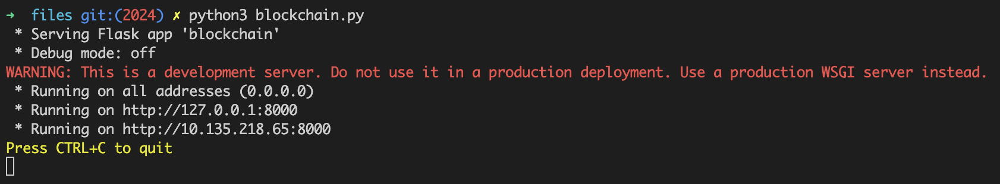<figcaption></figcaption></figure>

Now you can open your browser, and go to the address shown in the terminal (alternatively, go to 127.0.0.1:8000). There would be nothing at the address, as we didn't define what to show at the root address. Instead, go to `[address]/chain` to see what is currently in the blockchain. You should see something like below.

<figure>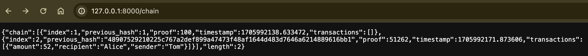<figcaption></figcaption></figure>

To create a new transaction, you need to use the `blockchain_transaction.py` code to do so, as you cannot easily create a post request via your browser. 

#### TASK 6 Complete the blockchain_transaction.py code
Complete the `blockchain_transaction.py` code. This is done by simply creating a new `new_transaction` - you can create the value of your own choices. Once done, you can run the code to create a new transaction. Make sure the post address is correct (should be fine leaving it as localhost). If done correctly, you should see a below message in the terminal.

<figure>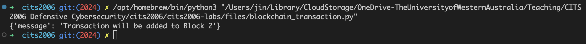<figcaption></figcaption></figure>

If you check you chain again, you may think you would see the new transaction but you won't. Because the new transaction has not been mined yet, which means it is not added to the blockchain yet. So we need to mine the block to add the new transaction to the blockchain, which is done by the `mine` method. You can do this by going to `[address]/mine` in your browser. You should see something like below.

<figure>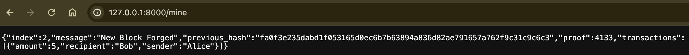<figcaption></figcaption></figure>

And if you go back to your chain, you will see the new transaction added to the blockchain!

<figure>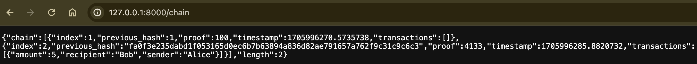<figcaption></figcaption></figure>

#### 1.3.6. The concensus algorithm
A conflict can occur in a Blockchain network when one node has a different chain to another node. A simple approach to resolve this problem is specifying rules which chain is the authoritative one. Simply, the longest valid chain is authoritative for our exercise (and this is true for typical blockchains).

Two methods in the blockchain class, `valid_chain` and `resolve_conflicts`, are provided. The valid_chain() method ensures that the existing chain is valid by checking each block of its hash and the proof. The resolve_conflicts() method will check all the neighbouring nodes, which downloads their chains and verifies them using the above method. If we find a valid chain that has a greater length that the existing one, we will replace it. Both methods are already implemented for you.

#### TASK 7 Checking the consensus algorithm
In this task, you are required to run two blockchain nodes on different ports. You can do this by running another flask app of the same code on a different port. Once both blockchains are running, we can use them to test the consensus algorithm as follows. Make sure you add some transactions in both blockchains. First, register the second node to the first one (and vice versa), which the output should look like below. Note, you will need to write your code to add a new node.

<figure><figcaption></figcaption></figure>

You will have added transactions to your blockchains:

<figure>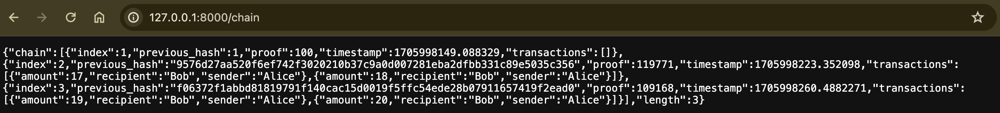<figcaption></figcaption></figure>
<figure>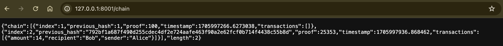<figcaption></figcaption></figure>


Finally, call the `nodes/resolve` on the nodes. You can observe that the chain is now replaced by the Consensus algorithm.

<figure>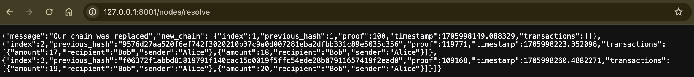<figcaption></figcaption></figure>


## 1.4 Summary

In this lab, we covered some key cryptography concepts, hashing and blockchain. There were additional tasks provided to better understand how these concepts are implemented to provide a deeper understanding of how they are used in our daily lives.

Next up, Privacy.

