# Lab 3: Access Control

## 3.1. Introduction
Access control has two fundamental components: authentication and authorization. Authentication is the process of verifying the identity of a user, process, or device. Authorization is the process of determining whether a user, process, or device is allowed to access a resource. In this lab, we will explore these concepts in more detail.

## 3.2. Authentication
Authentication is the process of verifying the identity of a user, process, or device. There are three primary methods of authentication: something you know, something you have, and something you are. These are often referred to as knowledge factors, possession factors, and inherence factors, respectively. In this lab, we'll try to implement some of these concepts, but due to physical limitations (i.e., only have access from your computer), some concepts like biometrics and tokens will not be covered. However, you'll have sufficient understanding to be able to implement them, if you need to.

### 3.2.1. Passwords
Passwords are the most common form of authentication. They are a knowledge factor, meaning that they are something you know. In this section, we will explore the use of passwords for authentication.

We'll start with the most simplest implementation, then add features to make it more secure. Download the template code for this section:

```
wget https://github.com/uwacyber/cits2006/raw/2024/cits2006-labs/files/password.py
```

Run this code to check that it is working correctly (i.e., with the right username and password, you can authenticate yourself).

<figure>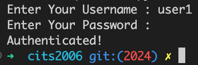<figcaption></figcaption></figure>

However, this is not secure at all. The password is stored in plaintext, and anyone who has access to the file can see the password. We will now add some security features to make it more secure.

### 3.2.2. Salting and Hashing
To make the password more secure, we will use a technique called salting and hashing. You should remember about hashing from Lab 1. Salting is the process of adding a random value to the password before hashing it. This makes it more difficult for an attacker to use a precomputed table of hashes (a rainbow table) to crack the password. Hashing is the process of converting the password into a fixed-length string of characters. This makes it difficult for an attacker to determine the original password from the hash.

We will use the `bcrypt` library to hash the password. Install this library if you haven't done already. This library automatically generates a random salt and hashes the password. But `bcrypt` uses byte string, so ensure to add `b` in front of your string (e.g., your password variable).

```python
database = {"user1": "123456", "user2": "654321"}
new_database = {}
for user, password in database.items():
    new_database[user] = bcrypt.hashpw(password.encode('utf-8'), bcrypt.gensalt())
```

The above code will convert the original database dictionary of plaintext to a new dictionary of hashed passwords. You can then use this new dictionary to authenticate users now. Checking the password using the `bcrypt` library is simple:

```python
bcrypt.checkpw(password, hashed_password)
```

#### TASK 1
Edit the rest of the code so that the authentication works correctly as intended. 


Note that, when checking the password you don't need to provide the salt to the checker, because the salt is stored in the hashed password. The `bcrypt` library will automatically extract the salt from the hashed password and use it to check the password. However, if you are implementing your own library or using other libraries, you may need to store the salt separately and provide it to the checker.


### 3.2.3. Time-based One-time Passwords (TOTP)
Time-based One-time Passwords (TOTP) are a form of two-factor authentication. They are a possession factor, meaning that they are something you have. TOTP works by generating a one-time password based on a shared secret and the current time. The shared secret is usually a QR code that is scanned into an authenticator app, such as Google Authenticator. The authenticator app then generates a one-time password based on the shared secret and the current time. The server can then verify the one-time password by generating the same one-time password based on the shared secret and the current time and comparing it to the one-time password provided by the user.

You can start with the basic template provided below:

```
wget https://github.com/uwacyber/cits2006/raw/2024/cits2006-labs/files/totp_mfa.py
```

The code is not quite complete, you will have to complete the `verify_totp` function to make it work properly (currently it will authenticate any code!). But first, let's look at the rest of the functions provided to you.

The `get_hotp_toke` function is the main one, where the hashing algorithm hmac is used to generate the token. First, it will convert the password (which is a string) to a byte string. It will use the current time (denoted as `intervals_no`) to create `msg`, and using the sha1 hashing algorithm, the hmac digest is created. The token is then generated by using the first four bytes from the hmac digest modulo 1000000 to generate a 6-digit token. Run the code with the same password a few times, you will notice that the token will not be the same!

#### TASK 2
Complete the `verify_totp` function to make it work properly. You will need to use the `get_hotp_token` function to generate the token, and then compare it with the token provided by the user. You will also need to use the `time` library to get the current time, also remembering that the token is supposed to expire after 10 seconds by default. The passed in `token` is the user-input, which means you should generate the possible tokens using the same password in the last 10 seconds and compare it with the user-input token.


## 3.3. Linux ACLs
Access Control Lists (ACLs) are a way to define more fine-grained access control than the traditional Unix file permissions. In this section, we will explore how to use ACLs to control access to files and directories in the Linux environment. Please note, if you are not familiar with permissions in Linux, please revisit lab 0. To do this section, you will need an access to a Linux environment (e.g., a VM would be sufficient).


### 3.3.1. Setting up the environment
We will start by creating a folder to keep files for sales department as below.
<figure>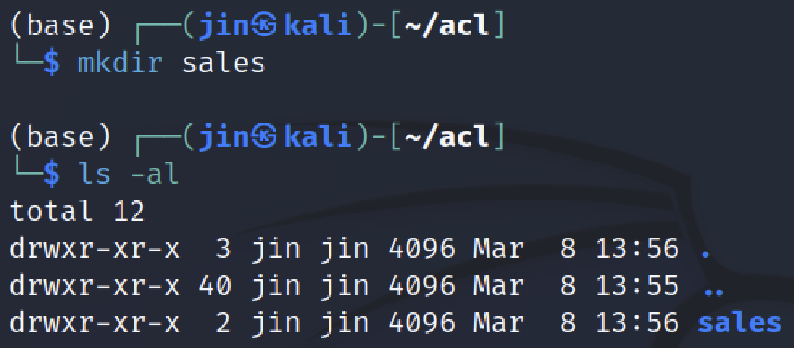<figcaption></figcaption></figure>

We can easily check the current ACL associated with this folder by using the `getfacl` command. The output will be similar to the following:
<figure>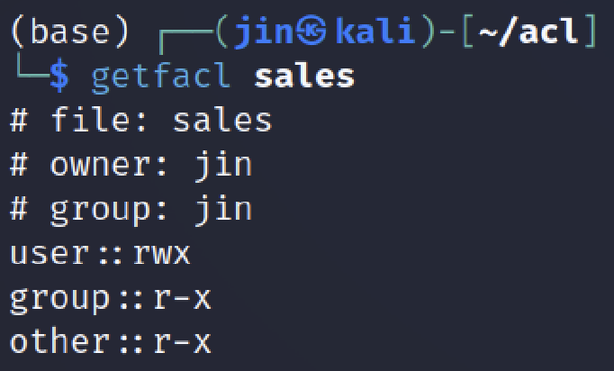<figcaption></figcaption></figure>

#### TASK 3
Obviously, we don't want to own this folder ourself (assumming you are using your own account and created the folder as above), as well as to give everyone access to this folder. We will (1) create a new group called `sales` and give the ownership to this group and user with the same name, and (2) remove the `other` permission. 


If this isn't familiar, please revise Lab 0!


Once complete, it should look as below:
<figure>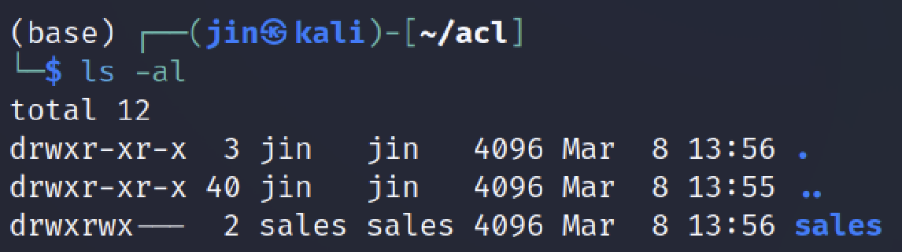<figcaption></figcaption></figure>

<figure>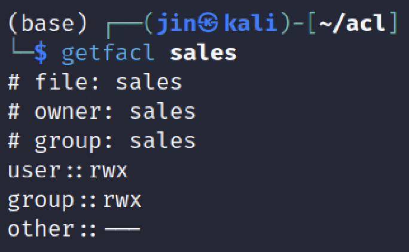<figcaption></figcaption></figure>


### 3.3.2. Using ACLs
Let's try and create a file inside the `sales` directory. Using your current account (which should not be in the `sales` group), try to create a file inside the `sales` directory. You will notice that you are not able to do so. This is because you don't have the permission to do so. We will now use ACLs to give you the permission to create files inside the `sales` directory.

This is done by adjusting the permission of the user using the `setfacl` command. The command to give the user permission to create files inside the `sales` directory is as follows:

```bash
setfacl -m u:your_username:rwx sales
```

Replace `your_username` with your username. After running this command, you should be able to create files inside the `sales` directory.

<figure>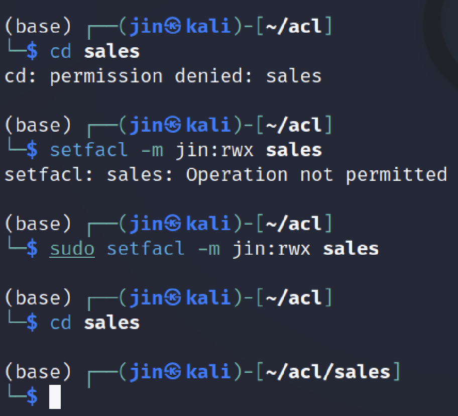<figcaption></figcaption></figure>

At this stage, create a couple of files inside the `sales` directory. We will use these files for later tasks.

Next, we will create a user `john`, and give him the permission to ONLY read the files inside the `sales` directory.

#### TASK 4
Create a user `john` and give him the permission to read the files inside the `sales` directory. Once complete, you should be able to check as below.

<figure>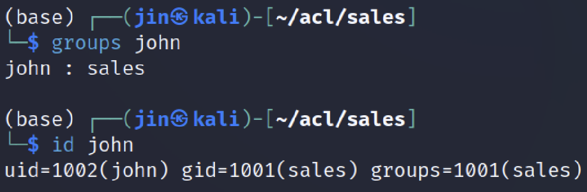<figcaption></figcaption></figure>

<figure>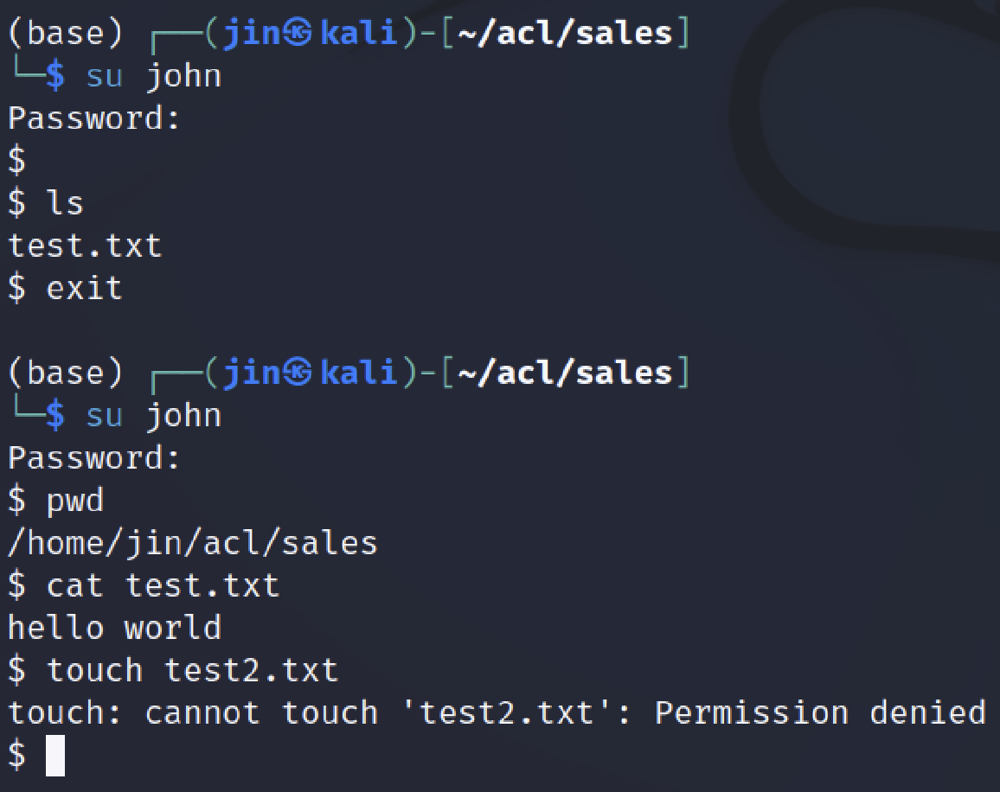<figcaption></figcaption></figure>


Because John cannot create files directly inside the `sales` directory, we will create a subdirectory called `john` inside the `sales` directory, and give John the permission to create files inside this subdirectory. If done correctly, you can see the permission as below.

<figure>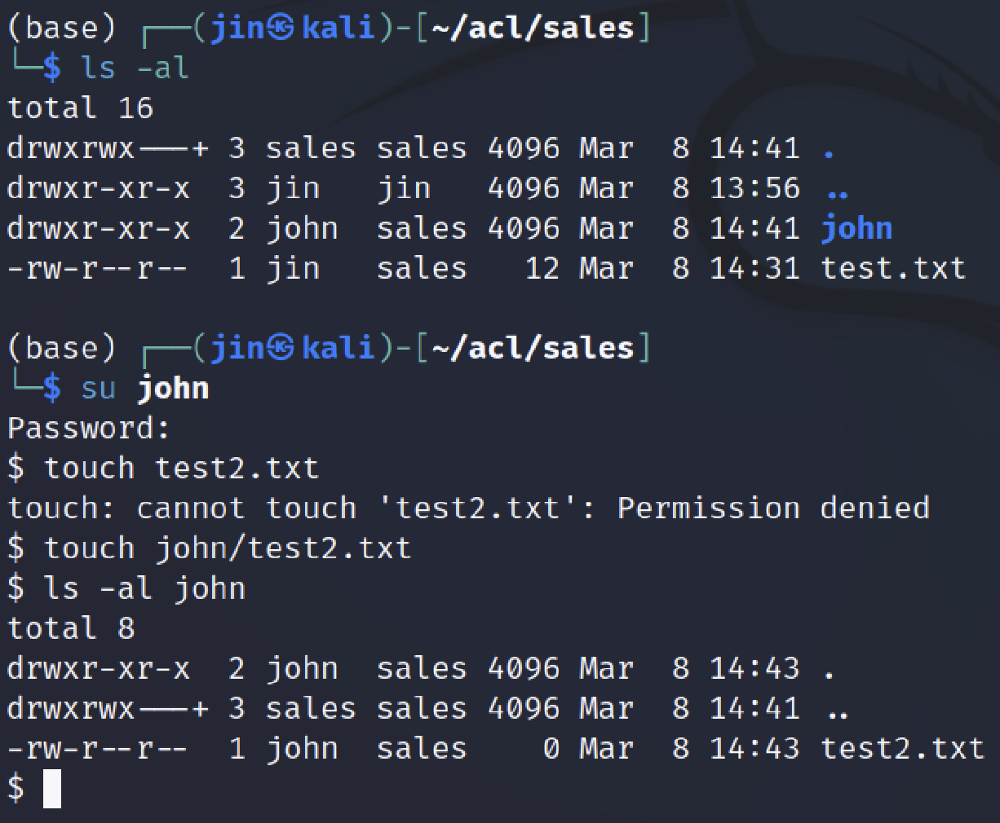<figcaption></figcaption></figure>

Since his folder belongs to the `sales` group, other members of the `sales` group can also access his folder (e.g., create files there, read files etc.). We may want to keep this directory private to John only. This can be achieved by removing permissions for specific users or groups.

```bash
setfacl -m david:- sales/john
setfacl -m g:sales:- sales/john
```

The first command will disallow David accessing John's directory, while the second command will disallow the `sales` group accessing John's directory. You should try and check that above permissions are working as intended. When you have done it, you should observe the same behaviour as below.

<figure>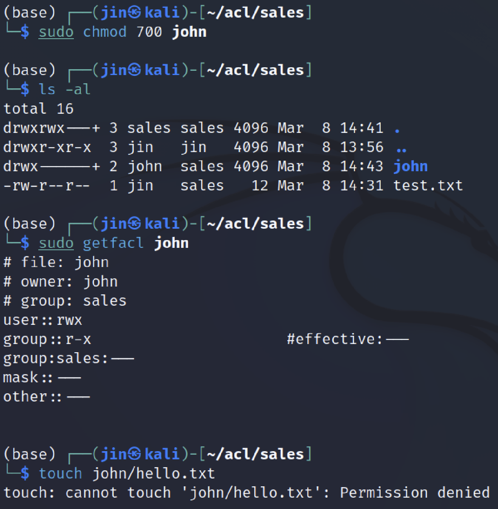<figcaption></figcaption></figure>


You still would like to give certain users permission to access John's directory (e.g., you are the boss and you want to access his directory). You can do this by adding the permission to the specific user or group.

```bash
setfacl -m u:your_username:rwx sales/john
```

Now, you are once again able to access John's directory. You should have the same behaviour as follows.

<figure>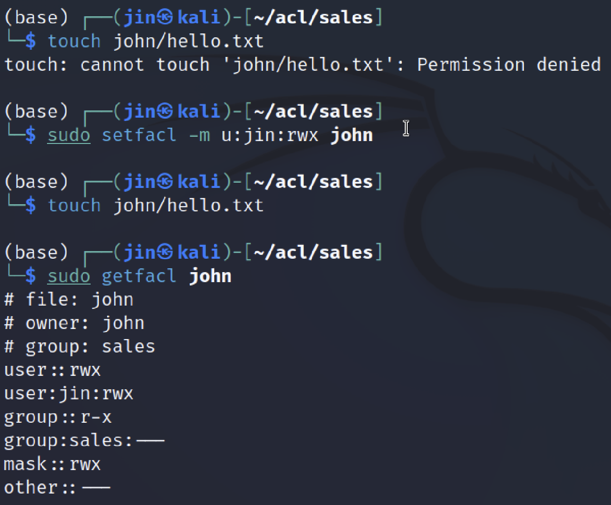<figcaption></figcaption></figure>


This covers the basics of using ACLs, now you can create and control access in Linux for various users. However, you would be able to see that this can become quite complex and difficult to manage. There are other concepts and methods, such as chroot, that can be used to control access in Linux. The concept of ACL isn't limited to Linux, it is also used in Windows and other operating systems. For example, the Active Directory in Windows uses ACLs to control access to files and directories.

## 3.4 Summary

In this lab, we looked at some fundamental controls used in access control. Obviously, we have more comprehensive suite of access control mechanisms used in practice, but these are the founding blocks of setting up access control. 

Next up, protocols and tools.
