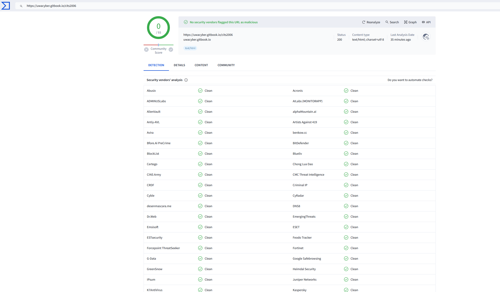
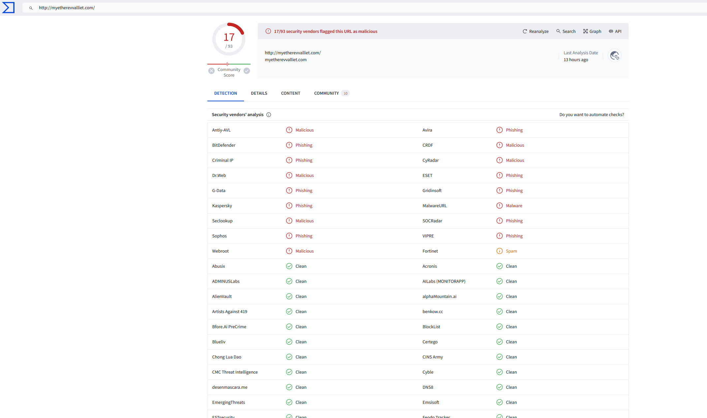

# Lab 4: Malware Detection with YARA



This lab involves working with binary and text files that are meant to be representative of malware samples. These files will be provided via Docker containers. While you will not be handling any live malware for this lab, the content and examples given should be relevant in the context of analyzing real malware.




You can do the YARA tasks in the Lab 0 container (`docker run --rm -it -v "$PWD:/work" cits2006-env`), which has a matched YARA CLI and Python binding. Keep your rules in your mounted folder so they survive after the container exits.


This lab will explore virus detection through the use of two different tools: YARA and VirusTotal. VirusTotal (Section 2) is optional in 2027.

YARA is an open-source tool designed to help malware researchers identify and classify malware samples. It allows users to create descriptions (or rules) for malware families based on textual and/or binary patterns. YARA is multi-platform, running on Linux, Windows, and macOS, and can be used through its command-line interface or from Python scripts with the YARA-Python extension.

VirusTotal is an online service that analyzes suspicious files and URLs to detect types of malware, including viruses, worms, and trojans. It uses a variety of tools, including YARA, to identify potential threats. VirusTotal also provides an API that allows users to automate the scanning process and integrate VirusTotal's capabilities into their own applications.

Requirements for this lab:

- [Docker](https://docs.docker.com/get-docker/), and the `cits2006-env` container from [Lab 0](lab-0-setup.md) (section 0.1, step 3)
- Optional, for Section 2 only: a [VirusTotal account](https://www.virustotal.com/gui/join-us) (the free tier will suffice)

This lab uses two containers:

- **`cits2006-env`** (the Lab 0 container) has the YARA command-line tool and the Python `yara` module, installed to match each other. Use it for the YARA tasks in Section 1.
- **`uwacyber/cits2006:lab4`** (the 2024 lab image) holds the files the tasks use: the samples in `/opt/samples`, example rules in `/opt/yara_rules` and script templates in `/opt/scripts`. These files are not in `cits2006-env`, so copy them into your own folder once:

```
mkdir -p ~/cits2006/lab4 && cd ~/cits2006/lab4
docker create --name lab4-files uwacyber/cits2006:lab4
docker cp lab4-files:/opt/. .
docker rm lab4-files
```

You now have `samples/`, `yara_rules/` and `scripts/` in your `lab4` folder. Then start the Lab 0 container from that folder:

```
docker run --rm -it -v "$PWD:/work" cits2006-env
```

You are now in `/work`, which is your `lab4` folder on your laptop. The rest of this sheet writes paths as they appear in the lab4 image, such as `/opt/samples/hello.txt`. In the Lab 0 container, use your copies instead (`samples/hello.txt`). Create and edit your rules and scripts on your laptop with your usual editor; the container sees them straight away.

You can also run the tasks directly in the lab4 image (`docker run -it --rm -v "$PWD:/work" uwacyber/cits2006:lab4`, saving your work in `/work`), but its `yara` command is YARA 3.9 (from Ubuntu 20.04) while its Python module is 4.5, and YARA 3.9 cannot compile some rules in this sheet (for example the `for any section in pe.sections` rule in 1.8). We recommend `cits2006-env`.


The use of YARA necessitates some understanding of concepts such as hex encodings and (to a lesser extent) regular expressions (regex). A few references you may find useful:

- [Hexadecimals](https://byjus.com/maths/hexadecimal-number-system/#:~:text=The%20hexadecimal%20number%20system%20is,digit%20represents%20a%20decimal%20value.)
- [Regular expression](https://developer.mozilla.org/en-US/docs/Web/JavaScript/Guide/Regular_expressions)
  

---

## 1. YARA

YARA is a tool used to identify and classify malware samples by creating descriptions of malware families based on textual or binary patterns. YARA rules are essentially a set of strings and a Boolean expression that determines the logic of the rule. You may be familiar with YARA from the CITS1003 course; we will expand upon that understanding by exploring more complex YARA rule writing, utilizing advanced string matching techniques and conditional logic to detect malware.

The key components of a YARA rule are:

- **Meta section:** Contains metadata about the rule like author, description, reference, etc. This information is not used for matching but provides context.
- **Strings section:** Defines the strings to search for, which can be text strings, hexadecimal strings, or regular expressions.
- **Condition section:** Contains the Boolean expression that determines if a rule matches or not based on the presence of the defined strings.

A YARA rule file (.yar) can contain multiple rules. To use the rules, you provide the rule file and target (file, directory, process) to the YARA command line tool.

We'll begin with a simple yara file example. In your `~/cits2006/lab4` folder, create a file called `rules.yar` with any editor on your laptop (inside the container it is `/work/rules.yar`, and it stays on your laptop after the container exits) and fill it with the following content:

```
rule hello_world
{
	meta:
        description = "basic yara file"
        author = "CITS2006"
	strings:
	   $hello = "hello, world!"
	condition:
	   $hello
}
```

The file contains a simple YARA rule named `hello_world`. The strings section defines the strings to search for. Here, we have a single text string `$hello` which contains the literal `"hello, world!"`. The `$` prefix denotes a string identifier. Text strings can be case-sensitive and are enclosed in double quotes. The condition section specifies the logic that determines if the rule matches. In this simple example, the condition is just `$hello`, meaning the rule will match any file or data that contains the literal string "hello, world!".

Let's create a few more rules.

### 1.1. Basic Strings and Conditions

We can create rules that aim to detect files containing specific text, binary, and regex patterns. In addition to the `hello_world` rule, add a new rule called `strings_example`:

```
rule hello_world
{
	meta:
        description = "basic yara file"
        author = "CITS2006"
	strings:
	   $hello = "hello, world!"
	condition:
	   $hello
}

rule strings_example {
    strings:
        $my_text_string = "text here"
        $my_hex_string = { E2 34 A1 C8 23 FB }
        $my_regex_string = /user\d{4}/ nocase

    condition:
        $my_text_string or $my_hex_string or $my_regex_string
}
```

Here's a breakdown of its components:

**Strings Section:**

- `$my_text_string`: Searches for the exact text string "text here". This is a case-sensitive ASCII string.

- `$my_hex_string`: Matches the specific byte sequence E2 34 A1 C8 23 FB. This is useful for identifying unique binary signatures in malware. The curly braces signify the definition of a hexadecimal string in YARA.

- `$my_regex_string`: Uses a [regular expression](https://developer.mozilla.org/en-US/docs/Web/JavaScript/Guide/Regular_expressions) to find patterns matching the text "user" followed by 4 digits, case-insensitive. The `nocase` modifier makes the search case-insensitive. Other modifiers like `wide`, `ascii`, and `fullword` provide even more options.


For a comprehensive documentation of the modifiers and their usage, check out the [YARA documentation](https://yara.readthedocs.io/en/stable/writingrules.html#strings).


**Condition Section:**

- `$my_text_string or $my_hex_string or $my_regex_string`: The rule will match if any of the three strings defined earlier are found in the target file. This condition provides three possible indicators of malware and will trigger a match if any one is present.

More complex conditions can be crafted using a variety of operators and functions. An analyst could use a rule like this as a starting point, iteratively adding more strings and conditions as they uncover additional malware characteristics. For example, the rule could be expanded to also check for specific file sizes, target certain file types, or require a minimum number of string matches. We will see a few of these conditions later. By combining multiple strings and conditions, YARA rules can be made very specific to a particular malware family.

### 1.2. Running `.yar` Files

To use a YARA file containing defined rules for identifying suspect files, you can execute the following command over a given target location:

```
yara rules.yar ./files
```

This command runs the `rules.yar` file on the `files` subdirectory. The output will show any files that match the rules defined in `rules.yar`, as well as the detecting rule itself.

### Task 1.1: Starting Out!

Try running your `rules.yar` file on the `hello.txt` file in the `/opt/samples` subdirectory. What outputs do you get? Inspect the contents of the `hello.txt` file and ensure that your rules are working as you'd expect.

### Task 1.2: Searching over Multiple Directories

The YARA command-line tool also allows for the application of the YARA file over multiple nested subdirectories in a recursive manner. For this task, you will need to parameterize the yara command line input to allow it to scan directories recursively.

First, note your output from the previous task. Now, adjust your command to scan through the `/opt/samples` subdirectory recursively. What do you now get as the output?

### Task 1.3: Python's `yara` Module

Try using the `yara` [Python module](https://github.com/VirusTotal/yara-python) to programmatically run your rules, which should give you greater freedom in automating them. Write a script that will run the `rules.yar` file over the `hello.txt` file.

In the Lab 0 container, `import yara` works without installing anything (run your script with `python3`; there is no `python` command in the container). On your laptop, install the module into the course virtual environment (activate it first with `source ~/cits2006/.venv/bin/activate`):

```
uv pip install yara-python
```

This gives you the Python module only, not the `yara` command, so run the command-line tasks in the container.

### 1.3. String Wildcards and Hex String Variations

In addition to basic strings and conditions, YARA provides a variety of advanced features for creating more targeted and effective rules. Let's explore some of these.

When defining hex strings in YARA, you can use wildcards and specify byte ranges or alternatives to make your rules more flexible. Here are some examples:

```
$a = {5C 70 68 6F 74 6F 2E 70 6E 67}
```

This defines a hex string that matches the exact byte sequence. Note the use of curly brackets instead of quotation marks.

```
$a = {5C 70 68 6F ?? ?F 2E 70 6E 67}
```

In this example, the question marks are wildcards. `??` matches any single byte in that position. A single `?` is a nibble wildcard (a nibble is half a byte, one hex digit): `?F` matches any byte whose second hex digit is `F`, such as `1F` or `6F`, but not `1E`. This is useful if you've detected a slight variation of a hex pattern across multiple samples.

```
$a={5C [2-10] 6F 74 6F 2E 70 6E 67}
```

Here, `[2-10]` is a jump: it matches any 2 to 10 bytes. The rule matches wherever `5C` is followed by 2 to 10 bytes of any value and then by the rest of the hex sequence; with fewer than 2 or more than 10 bytes in between, it does not match.

```
$a={5C (01 02 | 03 04) 6F 2E 70 6E 67}
```

The `(01 02 | 03 04)` syntax allows for specifying alternative byte sequences. This rule will match if the bytes after `5C` are either `01 02` or `03 04`.

These techniques give you a lot of flexibility in defining hex strings that can match variations of a specific pattern, which is often necessary when dealing with malware that may employ basic obfuscation or mutation techniques.

### 1.4. More Conditionals

YARA provides a few aliases for convenience in writing rules. For example, try replacing the condition `$my_text_string or $my_hex_string or $my_regex_string` in the `rules.yar` file with the condition `any of them`. This will instruct YARA to match any of the defined strings. Similarly, `all of them` is equivalent to `$my_text_string and $my_hex_string and $my_regex_string`, requiring all strings to be present in the file for a match to occur.

We can also customize how many matches need to be triggered as a condition for the rule to return what it deems a successful condition. Examples include:

- `any of them`: This condition will match if any of the defined strings are found in the target file.
- `all of them`: This condition requires all defined strings to be present in the file for a match to occur.
- `2 of ($a, $b, $c)`: This condition will return a match if at least two of the strings `$a`, `$b` or `$c` are found.
- `3 of them`: This condition will match if at least three of the defined strings are found in the target file.
- `$a and not $b`: This condition will match if string `$a` is found, but string `$b` is not found in the target file.
- `4 of ($a*)`: This condition will match if at least four strings matching the pattern `$a*` are found. The `*` is a wildcard that matches any string identifier starting with `$a` (`$a1`, `$a2`, ...).

### 1.5. File Signatures

File headers can be checked to identify specific file types; these can be incorporated into YARA rules for more accurate detection. This is done by looking at the "magic bytes" at the beginning of the file. These bytes are specific sequences that identify the file format. For instance, to detect a Windows PE executable, you could use:

```
condition:
    uint16(0) == 0x5A4D
```

This condition checks if the first two bytes of the file are "MZ" (the bytes `4D 5A`, which `uint16()` reads as 0x5A4D). Every Windows PE file starts with this DOS header (old DOS programs do too, so a stricter check also looks for `PE\0\0` at the offset stored at 0x3C: `uint32(uint32(0x3C)) == 0x00004550`). PE (Portable Executable) is the file format used for executables, object code, and DLLs (dynamic-link libraries) in Windows operating systems. It is a data structure that encapsulates the information necessary for the Windows OS loader to manage the wrapped executable code. This includes dynamic library references for linking, API export and import tables, resource management data and thread-local storage (TLS) data. A PE file consists of a number of headers and sections that tell the dynamic linker how to map the file into memory.

The concept of magic bytes applies to many other file formats as well. Each format has its own unique magic bytes that appear at the beginning of the file.

Note: YARA's `uint16()` and `uint32()` read **little-endian**, so for a byte sequence written in file order use `uint16be()`/`uint32be()`. (The MZ check above uses `uint16()` with the bytes reversed: the file starts with `4D 5A`, which `uint16(0)` reads as `0x5A4D`; `uint16be(0) == 0x4D5A` is the same check.)

Here are some examples:

- ELF (Executable and Linkable Format) files (used on Linux and other Unix-like systems):
  - `uint32be(0) == 0x7F454C46`
- Mach-O (Macintosh Object) files (used on macOS):
  - `uint32(0) == 0xfeedface or uint32(0) == 0xcefaedfe or uint32(0) == 0xfeedfacf or uint32(0) == 0xcffaedfe or uint32(0) == 0xcafebabe or uint32(0) == 0xbebafeca` (this line lists both byte orders, so plain `uint32()` is correct here; it also matches Java class files, which start with the same bytes as a Mach-O fat binary)
- Java class files:
  - `uint32be(0) == 0xCAFEBABE` (the same magic as a Mach-O fat binary, so check more bytes to tell them apart)
- PDF files:
  - `uint32be(0) == 0x25504446` (the ASCII characters "%PDF")
- ZIP files:
  - `uint32be(0) == 0x504B0304` (the ASCII characters "PK\x03\x04")
- PNG files:
  - `uint32be(0) == 0x89504E47 and uint32be(4) == 0x0D0A1A0A` (the bytes `\x89PNG\r\n\x1A\n`; YARA has no 64-bit integer function, so check two 4-byte words)

You can also apply these conditions in an exclusionary way. The following condition will not match with any such PE files.

```
uint16(0) != 0x5A4D
```

In addition, we can also specify the file size of the files we are matching. This can be done in a few ways:

- `(filesize > 512)` matches files that are larger than 512 bytes.
- `(filesize < 5000000)` matches files that are smaller than 5,000,000 bytes (about 4.77 MB).
- `(filesize < 5MB)` explicitly denotes the file size in megabytes (`KB` also works; YARA has no `GB`). These suffixes are powers of 1024, so `5MB` is 5,242,880 bytes and `1000KB` is 1,024,000 bytes.
- `(filesize < 1000KB or filesize > 3000KB)` matches files that are smaller than 1000KB or larger than 3000KB.

These conditions allow us to identify suspicious files. For example, a malware author might attempt to disguise a malicious executable as a harmless PDF file by changing the file extension from `.exe` to `.pdf`. However, if the file still starts with MZ (`uint16(0) == 0x5A4D`), a YARA rule can detect this discrepancy.

### Task 1.4. Masquerading Files?

Write a rule that matches files that start with the PE magic bytes (indicating an executable), are less than 2MB in size and have a filename ending in .pdf (YARA cannot see a file's name by itself: look up external variables and the `-d` option of the `yara` command). Such a file may be highly suspicious, as it claims to be a PDF (based on the extension) but is actually an executable. This technique of disguising malware as a benign file type is common and can be effectively detected using YARA rules that check for inconsistencies between the claimed file type (based on the extension or other metadata) and the actual file type (based on the magic bytes and other structural characteristics).

You can test your rules on the `suspicious.pdf` file in the `/opt/samples/` directory.

### 1.6. Detecting URLs

Malware may call various URLs to perform malicious redirects and network communications. These URLs might lead to command and control servers, malware download sites, or phishing pages. Here's an example of a YARA rule that tries to detect URLs:

```
rule obfuscated_url {
    strings:
        $regex_url = /http[s]?:\/\/[a-zA-Z0-9\-\.]+\.[a-zA-Z]{2,}\/[a-zA-Z0-9\/%&=\?_\-\.]+/ nocase
    condition:
        $regex_url and (#regex_url > 10)
}
```

This rule uses a [regular expression](https://developer.mozilla.org/en-US/docs/Web/JavaScript/Guide/Regular_expressions) `$regex_url` to match URLs. Let's break down the components of the regex to understand its functionality in more depth:

- `http[s]?:\/\/`: This part of the regex matches the beginning of a URL, specifically looking for `http://` or `https://`. The square brackets `[s]` indicate that the "s" is optional, allowing for both HTTP and HTTPS protocols. The `?` makes the preceding character optional, and the `:\/\/` matches the "://" part of the URL.

- `[a-zA-Z0-9\-\.]+`: This segment matches one or more (`+`) alphanumeric characters, hyphens (`-`), or periods (`.`). This part is designed to match the domain name of the URL, which can include letters, numbers, hyphens, and periods.

- `\.[a-zA-Z]{2,}`: This part matches a period followed by two or more (`{2,}`) alphabetic characters. This is intended to match the top-level domain (TLD) of the URL, such as ".com", ".org", etc.

- `\/[a-zA-Z0-9\/%&=\?_\-\.]+`: This segment matches a forward slash (`\/`) followed by one or more alphanumeric characters, slashes (`/`), percent signs (`%`), ampersands (`&`), equals signs (`=`), question marks (`?`), underscores (`_`), hyphens (`-`), and periods (`.`). This part is designed to match the path and query parameters of the URL, which can include various characters used in URLs.

- The nocase modifier at the end of the regex makes the entire pattern case-insensitive, allowing it to match URLs regardless of the case of the letters.

The condition checks if there are more than 10 occurrences of the URL pattern (`#regex_url > 10`). Malware often includes multiple redundant or backup URLs.

If crafting the regex string is a bit intimidating, we can instead be specific about what we want to match on. For example, we can specify the TLDs to match, if we believe the malware is using domain names with uncommon or suspicious TLDs. These TLDs might be chosen because they are cheap, have lax registration policies, or are rarely used by legitimate websites. Examples of suspicious TLDs include .xyz, .top, .pw, .cc, .tk, among others:

```
rule suspicious_tlds {
    strings:
        $tld1 = ".xyz" nocase
        $tld2 = ".top" nocase
        $tld3 = ".pw" nocase
        $tld4 = ".cc" nocase
        $tld5 = ".tk" nocase
    condition:
        any of them
}
```

It's important to note that the presence of a URL or a suspicious TLD doesn't necessarily mean that a file is malicious. There can be legitimate uses for these techniques. However, when combined with other indicators, they can help identify files that warrant further investigation.

### Task 1.5. Free Bitcoin (?)

URLs may also be obfuscated to hide the true intent and destination of network communications. Obfuscation techniques can include:

- Encoding: The URL or parts of it might be encoded using URL encoding, base64, or other schemes.
- Randomization: The URL might include random strings to make it unique and evade simple string matching.
- Splitting: The URL might be split into multiple parts that are concatenated at runtime.

Write a set of YARA rules that would be able to detect the obfuscated URLs contained in the `free_bitcoin.txt` file in `/opt/samples`, which is emulating the contents of a simple phishing email. You should see that part of the file contains a base64 encoded string (which you should be able to recognise as base64!). You will thus likely need to combine YARA rules with additional code to assist in decoding the obfuscated URLs. A few hints that can lead to one possible solution:

- Start with a Python script that compiles a set of YARA rules.
- Read the contents of the `free_bitcoin.txt` file, and find all instances of base64 encoded strings (find out how!)
- Decode all found strings (again, find out how) and apply your YARA rules.

### 1.7. Suspicious Strings and Commands

Malware often needs to execute commands on the infected system to perform various malicious actions, such as downloading additional malware, modifying system settings, or stealing data. We can try to detect files attempting to execute commands silently:

```
rule suspicious_command_execution {
    strings:
        $cmd_exec = "cmd.exe /c" nocase
        $powershell_exec = "powershell.exe -ExecutionPolicy Bypass" nocase
        $suspicious_api = "CreateProcess" nocase
    condition:
        uint16(0) == 0x5A4D and filesize < 500KB and
        ($cmd_exec or $powershell_exec) and $suspicious_api
}
```

Other suspicious activities include network reconnaissance:

```
rule reconnaissance_command_execution {
   strings:
      $str1 = "tasklist"
      $str2 = "net time"
      $str3 = "systeminfo"
      $str4 = "whoami"
      $str5 = "nbtstat"
      $str6 = "net start"
      $str7 = "qprocess"
      $str8 = "nslookup"
   condition:
      filesize < 5KB and 4 of them
}
```

Or attempts at gaining privileged access, such as adding a user account to the local administrators group:

```
rule add_user_to_administrators {
   strings:
      $x1 = /net localgroup administrators [a-zA-Z0-9]{1,16} \/add/ nocase ascii
   condition:
      all of them
}
```

Often we will also see suspicious strings contained in the malware that will be associated with those operations, or convey malicious intent. For example:

```
rule potential_ransomware_strings {
    strings:
        $str1 = "payment" nocase
        $str2 = "decrypt" nocase
        $str3 = "encrypted" nocase
        $str4 = "bitcoin" nocase
    condition:
        any of them
}
```

These strings might be present in the ransom note displayed to the victim of a ransomware attack.

### 1.8. Importing Modules (Optional)

YARA modules extend the capabilities of YARA rules, allowing for more complex and targeted analysis of files. Modules are written in C and built into YARA during the compilation process. They enable the creation of custom rules by defining data structures and functions that can be utilized within YARA rules to express more intricate conditions.

To use a module in a YARA rule, you must first import it. This is done using the `import` statement at the beginning of your rule file. The PE module is particularly useful for analyzing PE (Portable Executable) files, which are the standard executable format for Windows. Here are some simple examples demonstrating the use of the PE module:

```
import "pe"

rule single_section {
    meta:
        description = "checks if a PE file has only one section, which might be indicative of certain types of malware"
    condition:
        pe.number_of_sections == 1
    }

rule control_panel_applet {
    meta:
        description = "looks for the presence of an exported function named 'CPlApplet', which is often used by malware to execute code in the context of the Control Panel."
    condition:
        pe.exports("CPlApplet")
    }


rule is_dll {
    meta:
        description = "checks if the PE file is a DLL by examining its characteristics"
    condition:
        pe.characteristics & pe.DLL
}

rule is_pe {
    meta:
        description = "simply checks if the file is a valid PE file"
    condition:
        pe.is_pe
}
```

The Math module provides mathematical functions that can be used within YARA rules. Here's an example that demonstrates how to use the Math module to check for high entropy in a section of a PE file:

```
import "pe"
import "math"

rule entropy_check {
    condition:
        for any section in pe.sections : (
            section.name == ".text" and
            math.entropy(section.raw_data_offset, section.raw_data_size) > 7.5
        )

}
```

This rule calculates the entropy of the `.text` section of a PE file. Entropy in the cybersecurity context refers to the amount of randomness or disorder in the data. "High" entropy values (here, greater than 7.5) might indicate obfuscated or encrypted code, which could be a sign of malicious activity. Malware often uses these techniques to hide its malicious code and evade detection. Measuring entropy helps identify sections of code or data that are more random and complex than typical code. This is useful for detecting packed or encrypted malware, as the entropy of these sections will be higher than normal.

### Task 1.6. Real-World YARA Rules (Optional)

Included in the `/opt/yara_rules` directory is a `.yar` file called `known_malware_rules.yar`. This YARA file contains rules that have been developed to target certain prolific malware families, such as Stuxnet and WannaCry.


More information on these malware:

- [Stuxnet](https://www.kaspersky.com/resource-center/definitions/what-is-stuxnet)
- [WannaCry](https://www.kaspersky.com/resource-center/threats/ransomware-wannacry)
  

If you've taken the CITS1003 unit, you will have used this same YARA file in the 'Incidents' lab. However, the specifics of YARA rules and malware detection were likely glossed over in that lab. With your current understanding, you should now be equipped to read and interpret these YARA rules to understand what they are doing. Take a look at the rules for some of the well-known malware families and get a sense for how they work. Discuss any interesting aspects you notice with your lab partners or the facilitators. What unique characteristics of the malware are the rules looking for? How are the rules structured and what conditions need to be met for them to trigger a match?

## 2. VirusTotal (optional in 2027: needs a free account; not used in assessments)

VirusTotal is an online service that analyzes suspicious files and URLs to detect types of malware, including viruses, worms, and trojans. It uses a variety of tools, including YARA, to identify potential threats. VirusTotal also provides an API that allows users to automate the scanning process and integrate VirusTotal's capabilities into their own applications.

VirusTotal operates by taking a file or URL and running it through a suite of antivirus engines, website scanners, and other tools to detect any known malware signatures. The service aggregates the results from these tools to provide a comprehensive report on the file or URL's safety. This report includes information on the detection engines that flagged the file or URL, the type of malware detected (if any), and additional metadata about the file or URL.

For instance, when scanning a URL such as https://uwacyber.gitbook.io/cits2006, VirusTotal assesses the URL for potential security threats by utilizing its multiple antivirus engines and website scanners. Security vendors, which are companies that provide cybersecurity solutions and services, contribute to this analysis by using their own detection engines to evaluate the URL. The outcome of this scan is a detailed report that includes the security vendors' analysis, indicating whether any of the participating vendors have flagged the URL as malicious. Additionally, the report provides further web-related details, such as the detected content type, the last analysis date, and the status code returned by the server, which can be indicative of the website's current accessibility and health. In this case, the reports show that the website seems to be legitimate.

<figure><figcaption>Legitimate VirusTotal URL Scan</figcaption></figure>

We can scan suspicious URLs, such as those that appear in phishing email attempts, in the same way.

<figure><figcaption>Suspicious VirusTotal URL Scan</figcaption></figure>

### Task 2.1: Upload a Suspicious File to VirusTotal

Try uploading a few of the files from `/opt/samples` to VirusTotal. What do the outputted reports tell you? Do you get different reports for different malwares?

### Task 2.2: Using the VirusTotal API

VirusTotal also offers an [API](https://docs.virustotal.com/reference/files-scan) that allows for automated interaction with their service without needing to use the webpage interface. The API enables you to upload and scan files, submit and scan URLs, access finished scan reports, and make automatic comments on URLs and samples. To use the VirusTotal API, you need to have an API key, which you can obtain by creating an account on the VirusTotal website. Once you have your API key, you can use it to make requests to the VirusTotal API to upload files for scanning, retrieve reports on files or URLs, and perform other operations supported by the API.


Note the usage and rate limits applied to your access, which should be 4 lookups per minute on the free tier.


To find your API key, sign in to VirusTotal, click your profile icon at the top right and choose **API key**. The same page shows your quota. Treat the key like a password: read it from an environment variable in your script instead of writing it into the file (for example `read -rs VT_API_KEY && export VT_API_KEY`, which keeps it out of your shell history, then `os.environ["VT_API_KEY"]` in Python; add `-e VT_API_KEY` to `docker run` if you run the script in a container), so that you do not commit it to git or share it by accident.

In this task, you will write a script to upload a file to VirusTotal for scanning. This script will use the VirusTotal API to upload the file and then retrieve and display the scan results. Write a script in your chosen programming language that performs the following steps:

- Reads the file you want to scan.
- Makes an HTTP POST request to the VirusTotal API to upload the file for scanning.
- Retrieves the scan results using the API.
- Analyses the scan results.

To get you started, use the template script in `/opt/scripts` (`scripts/` in your copy), in which you will complete the necessary code. Try your code out on some of the other samples in the `/opt/samples` directory. Run your script on your laptop in the course virtual environment, where `requests` is already installed, or inside the lab4 image; the `cits2006-env` container does not have `requests`.

After running your script, you will receive a JSON response containing the scan results. This response includes information on the detection engines that flagged the file, the type of malware detected (if any), and additional metadata about the file. Examine the JSON response to understand the structure of the scan results. Pay special attention to the fields which contain the detection results from various engines. Based on the detection results, determine whether the file is likely to be malicious. Consider the number of engines that flagged the file and the types of malware detected.

### Task 2.3: Automating File Scanning

Now that you have a basic script for uploading a file to VirusTotal and retrieving the scan results, you can automate the scanning process for multiple files. Modify your script to accept a list of file paths and iterate over this list, uploading each file to VirusTotal and displaying the scan results. Files over the upload size limit are rejected outright; separately, the free API allows 4 requests per minute, so add a delay between requests. Your script should handle both situations gracefully. What should it do with a file that is over the size limit, and what should it do when VirusTotal tells it to slow down (skip and report, wait and retry, or stop)? Which do you think is the better approach in each case?
