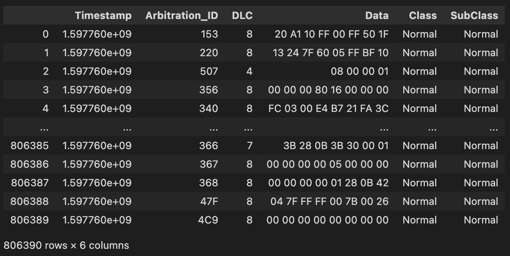
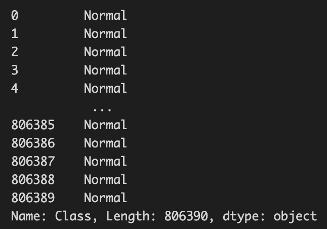
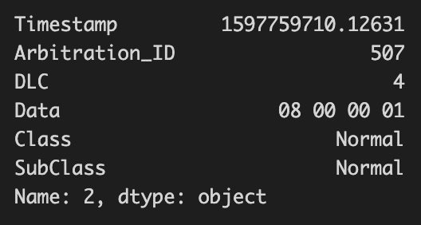
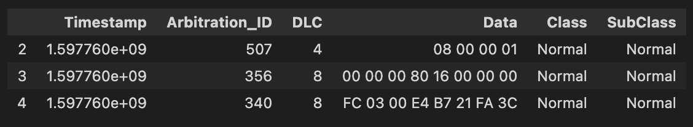
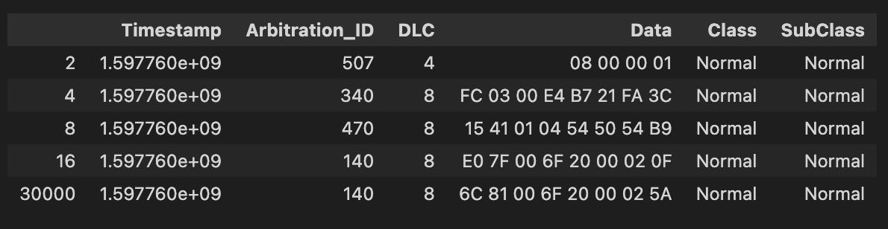
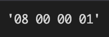
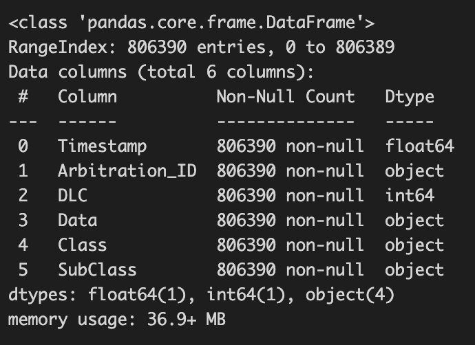
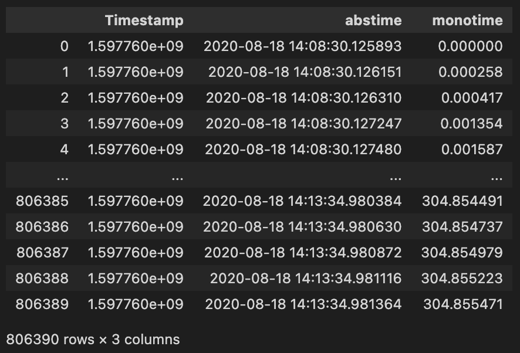
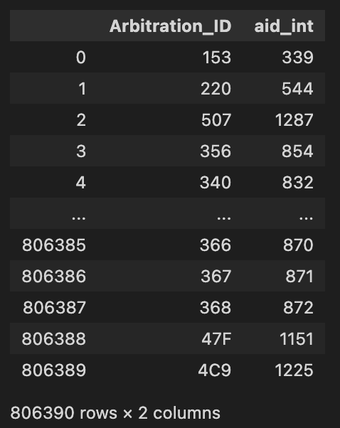
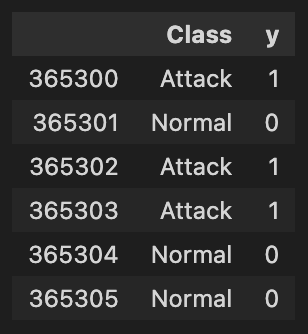

# Lab 5: IDS (NOT READY)

## 5.1. Introduction
In this lab, we will setup and run IDS for vehicle network. Smart cars are becoming more widely used today, allowing hackers to gain access to the vehicle network and control the vehicle. Consequently, the attacker can cause undesireable effects on the car, which can physically impact the driver and passengers. Therefore, it is important to detect and prevent such attacks.

## 5.2. Lab Environment
We will use Jupyter notebook to conduct this lab. To do this, we need to have the Jupyter notebook installed. You could technically use the web version, but that would require uploading files (i.e., datasets), which will take time to setup. Therefore, you are encouraged to use the local version of Jupyter notebook (e.g., plugin to VSCode or other similar IDEs).

If you are stuck getting Jupyter notebook running, it is a good time to seek help from the facilitator.



Before you start, download the files you need:
```
wget https://github.com/uwacyber/cits2006/raw/2024/cits2006-labs/files/ids.zip
```


## 5.3. Data Manipulation
In order to perform IDS, we need to first understand how to access and manipulate dataset we will be using. This is done by using [Pandas](https://pandas.pydata.org/), a Python library for data analysis. We will use Pandas to access the dataset and perform data analysis. If you already know how to use Pandas, you may skip this section (you can always come back as necessary).


In this section, we will be using the pandas.ipynb from the zip file.


### 5.3.1. Loading the data
Pandas provides a DataFrame class, which is a 2D array (i.e., a table). We will use the DataFrame class to load the dataset and perform data analysis. This is simply done by importing pandas, then loading dataset using pandas (such as CSV files).

```python
import pandas as pd

df = pd.read_csv('dataset.csv')
```

#### TASK 1
Rewrite the code in your Jupyter notebook's first cell so that it loads the file: 0_Preliminary/0_Training/Pre_train_D_1.csv

You should get an output similar to this:
<figure><figcaption></figcaption></figure>


### 5.3.2. Accessing the data
- [DataFrame](https://pandas.pydata.org/docs/reference/api/pandas.DataFrame.html): a Pandas class representing a table (2D array)
- [Series](https://pandas.pydata.org/docs/reference/api/pandas.Series.html): a Pandas class representing an 1D array

#### DataFrame
There are three main cases on how you can access the dataframe using pandas:
- Case 1. Access a column: **`df[COL_IDX]`**, `df.loc[, COL_IDX]` -> It returns a *Series*.
- Case 2. Access a row: **`df.loc[ROW_IDX]`**, `df.loc[ROW_IDX, ]`  -> It returns a *Series*.
- Case 3: Access an element: `df.loc[ROW_IDX, COL_IDX]` -> It returns a *value*.

The first two cases will return a *Series* object, which is a 1D array. You can access the value of the *Series* object using the index (e.g., `series[IDX]`). The last case is used to access a value in the dataframe by specifying both the row and column index.

#### Series
Just consider it a Python list: `series[IDX]`

For more information, you should read the pandas documentation:
[Pandas user guide: Indexing and selecting data](https://pandas.pydata.org/docs/user_guide/indexing.html)

#### TASK 2 (2.1 - 2.5)
Write the code required in subsequent cells as specified in the comments.
You should also experiment by trying to load different series as well as values.

You should get an output similar to this:
<figure><figcaption>Task 2.1</figcaption></figure>

<figure><figcaption>Task 2.2</figcaption></figure>

<figure><figcaption>Task 2.3</figcaption></figure>

<figure><figcaption>Task 2.4</figcaption></figure>

<figure><figcaption>Task 2.5</figcaption></figure>


### 5.3.3 Conditional Indexing
We can filter out unnecessary or uninterested data using conditional indexing. Below is a simple example that filters all DLC values not equal to 8.

```python
df['DLC'] != 8:
```

This code returns a series of booleans, which can be used to filter the dataframe. For example, we can filter the dataframe using the code below:

```python
df2 = df[df['DLC'] != 8]
df2
```

Another convenience way is to user the query method provided by pandas.

```python
df2 = df.query('DLC != 8')
df2
```

This is useful because the query method supports the python expressions.

```python
df2 = df.query('DLC in (4, 6)')
df2
```

Finally, conditions can be chained together.

```python
condition1 = (df['Data'] == "00 00 00 00 00 00 08 EB")
condition2 = (df['Timestamp'] >= 50)
df3 = df[condition1 & condition2]
# or in short:
# df3 = df.query('Data == "00 00 00 00 00 00 08 EB" and Timestamp >= 50')
df3
```


### 5.3.4. Checking the dataset validity
There are a few things to consider for us to determine whether the given dataset is valid or not. In our case, the three main checks are:
- Is there any missing values (e.g., NA or NaN)?
- Are the messages in the correct order?
- Any preprocessing required?

To answer the first question, we can simply run the code below.

```python
df.isna().any()
```

If any values are NA or NaN, then the output will indicate True in the corresponding row.

To answer the second question, you have to devise a code that checks the timestamps are in the right (ascending) order. An example code is provided for you.

```python
# case 1. manual iteration
for i in range(len(df['Timestamp']) - 1):
    if not (df.loc[i + 1, 'Timestamp'] > df.loc[i, 'Timestamp']):
        print('[Case 1] Something went wrong.')
        break
else:
    print('[Case 1] The dataset is sorted by timestamp.')

# case 2. Pandas API
is_sorted = df['Timestamp'].is_monotonic_increasing
if sorted:
    print('[Case 2] The dataset is sorted by timestamp.')
else:
    print('[Case 2] Something went wrong.')
```

You only have to run one of the two cases provided, but you are encouraged to try both and see how they differ.


Finally, we check if any preprocessing is needed. This is a bit tricky, as you need to look at each column to see whether you have expected data type or not. The code below shows the information about the dataframe we have loaded.

```python
df.info()
```

<figure><figcaption></figcaption></figure>

You will see something similar as the figure shown above. The Dtype object specifies that it is stored as a string. We observe 3 issues:
1. The scientific notation of `Timestamp` is not straightforward.
2. `Arbitration_ID` was supposed to be represented as an integer. But the data type is string (object).
2. `Class` : 'Normal' -> 0, 'Attack' -> 1

We will resove these problems as below.

#### Timestamp
We will make two new timestamp fields.
 - the absolute timestamp
 - the monotonic timestamp *starting with 0*

The below code converts the timestamp to the absolute timestamp.

```python
df['abstime'] = pd.to_datetime(df['Timestamp'], unit='s').round('us')
df['monotime'] = df['Timestamp'] - df['Timestamp'].min()
df[['Timestamp', 'abstime', 'monotime']]
```

<figure><figcaption></figcaption></figure>


#### Arbitration ID
The issue with the arbitration ID (AID) is that the values are in hex, but pandas did not recognised it. We can let pandas know and store the values as integers using the code below.

```python
def func_hexstr_to_int(value):
    return int(value, 16)


df['aid_int'] = df['Arbitration_ID'].map(func_hexstr_to_int)  #
df[['Arbitration_ID', 'aid_int']]
```

<figure><figcaption></figcaption></figure>

#### Class
The term ‘Class’ here refers to whether the data is part of an attack or not. Class is is usually binary classification (either an attack or normal). Here, value 0 indicates that it is a normal traffic, while value 1 indicates that this is an attack traffic. We can simply count the number of attacks and normal traffic using the code below.

```python
df['Class'].value_counts()
```


You can also write some code to make the presentation easier to read.

```python
dict_class = {'Normal': 0, 'Attack': 1}
df['y'] = df['Class'].map(dict_class)
df[['Class', 'y']].loc[365300:365300 + 5]
```

<figure><figcaption></figcaption></figure>

Now you should have sufficient knowledge to use pandas to manipulate datasets for this lab.


## 5.4. Exploring the dataset


## 5.5. Interval-based IDS
Coming soon...


## 5.6. Entropy-based IDS
Coming soon...

