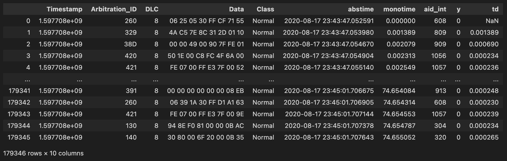
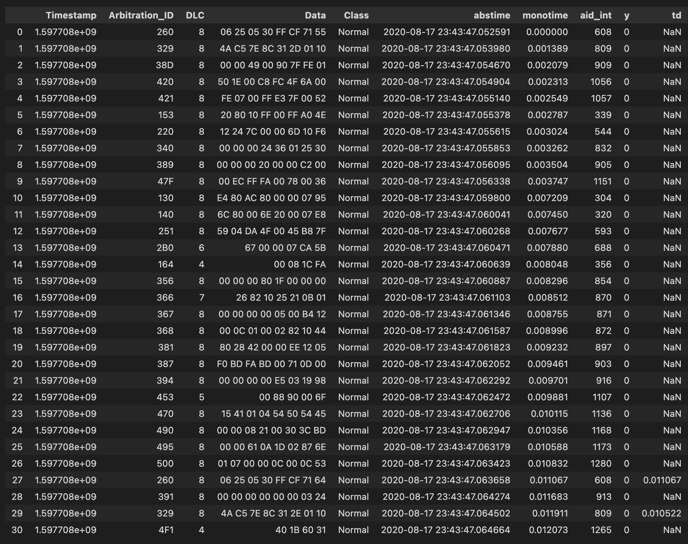
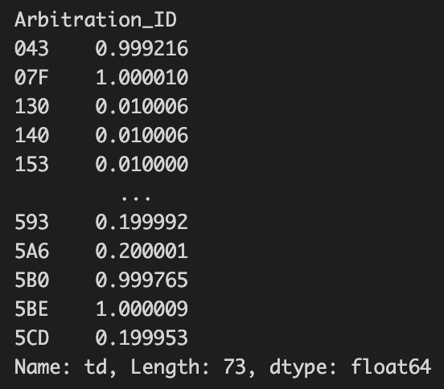
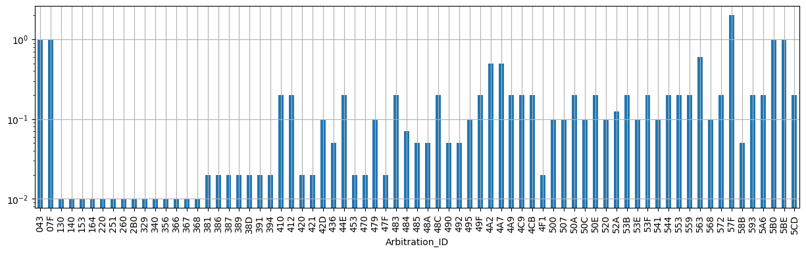
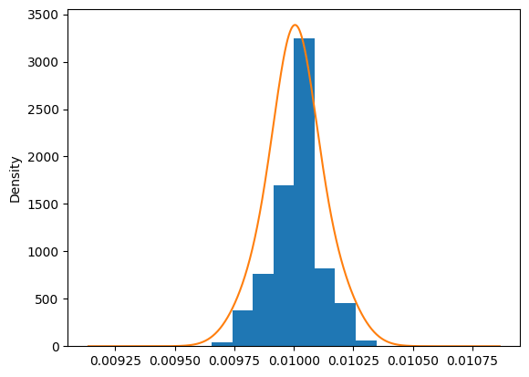

# Lab 5: Intrusion Detection System (NOT READY)

## 5.1. Introduction
In this lab, we will setup and run intrusion detection system (IDS) for vehicle network. Smart cars are becoming more widely used today, allowing hackers to gain access to the vehicle network and control the vehicle. Consequently, the attacker can cause undesireable effects on the car, which can physically impact the driver and passengers. Therefore, it is important to detect and prevent such attacks.

## 5.2. Lab Environment
We will use Jupyter notebook to conduct this lab. To do this, we need to have the Jupyter notebook installed. You could technically use the web version, but that would require uploading files (i.e., datasets), which will take time to setup. Therefore, you are encouraged to use the local version of Jupyter notebook (e.g., plugin to VSCode or other similar IDEs).

If you are stuck getting Jupyter notebook running, it is a good time to seek help from the facilitator.



Before you start, download the files you need:
```
wget https://github.com/uwacyber/cits2006/raw/2024/cits2006-labs/files/ids.zip
```


## 5.3. Data Manipulation
In order to perform IDS, we need to first understand how to access and manipulate dataset we will be using. This is done by using [Pandas](https://pandas.pydata.org/), a Python library for data analysis. We will use Pandas to access the dataset and perform data analysis. If you already know how to use Pandas, you may skip this section (you can always come back as necessary).


We will be using the pandas.ipynb from the zip file.


### 5.3.1. Loading the data
Pandas provides a DataFrame class, which is a 2D array (i.e., a table). We will use the DataFrame class to load the dataset and perform data analysis. This is simply done by importing pandas, then loading dataset using pandas (such as CSV files).

```python
import pandas as pd

df = pd.read_csv('dataset.csv')
```

#### TASK 1
Rewrite the code in your Jupyter notebook's first cell so that it loads the file: 0_Preliminary/0_Training/Pre_train_D_1.csv

You should get an output similar to this:
<figure><figcaption></figcaption></figure>


### 5.3.2. Accessing the data
- [DataFrame](https://pandas.pydata.org/docs/reference/api/pandas.DataFrame.html): a Pandas class representing a table (2D array)
- [Series](https://pandas.pydata.org/docs/reference/api/pandas.Series.html): a Pandas class representing an 1D array

#### DataFrame
There are three main cases on how you can access the dataframe using pandas:
- Case 1. Access a column: **`df[COL_IDX]`**, `df.loc[, COL_IDX]` -> It returns a *Series*.
- Case 2. Access a row: **`df.loc[ROW_IDX]`**, `df.loc[ROW_IDX, ]`  -> It returns a *Series*.
- Case 3: Access an element: `df.loc[ROW_IDX, COL_IDX]` -> It returns a *value*.

The first two cases will return a *Series* object, which is a 1D array. You can access the value of the *Series* object using the index (e.g., `series[IDX]`). The last case is used to access a value in the dataframe by specifying both the row and column index.

#### Series
Just consider it a Python list: `series[IDX]`

For more information, you should read the pandas documentation:
[Pandas user guide: Indexing and selecting data](https://pandas.pydata.org/docs/user_guide/indexing.html)

#### TASK 2 (2.1 - 2.5)
Write the code required in subsequent cells as specified in the comments.
You should also experiment by trying to load different series as well as values.

You should get an output similar to this:
<figure><figcaption>Task 2.1</figcaption></figure>

<figure><figcaption>Task 2.2</figcaption></figure>

<figure><figcaption>Task 2.3</figcaption></figure>

<figure><figcaption>Task 2.4</figcaption></figure>

<figure><figcaption>Task 2.5</figcaption></figure>


### 5.3.3 Conditional Indexing
We can filter out unnecessary or uninterested data using conditional indexing. Below is a simple example that filters all DLC values not equal to 8.

```python
df['DLC'] != 8:
```

This code returns a series of booleans, which can be used to filter the dataframe. For example, we can filter the dataframe using the code below:

```python
df2 = df[df['DLC'] != 8]
df2
```

Another convenience way is to user the query method provided by pandas.

```python
df2 = df.query('DLC != 8')
df2
```

This is useful because the query method supports the python expressions.

```python
df2 = df.query('DLC in (4, 6)')
df2
```

Finally, conditions can be chained together.

```python
condition1 = (df['Data'] == "00 00 00 00 00 00 08 EB")
condition2 = (df['Timestamp'] >= 50)
df3 = df[condition1 & condition2]
# or in short:
# df3 = df.query('Data == "00 00 00 00 00 00 08 EB" and Timestamp >= 50')
df3
```


### 5.3.4. Checking the dataset validity
There are a few things to consider for us to determine whether the given dataset is valid or not. In our case, the three main checks are:
- Is there any missing values (e.g., NA or NaN)?
- Are the messages in the correct order?
- Any preprocessing required?

To answer the first question, we can simply run the code below.

```python
df.isna().any()
```

If any values are NA or NaN, then the output will indicate True in the corresponding row.

To answer the second question, you have to devise a code that checks the timestamps are in the right (ascending) order. An example code is provided for you.

```python
# case 1. manual iteration
for i in range(len(df['Timestamp']) - 1):
    if not (df.loc[i + 1, 'Timestamp'] > df.loc[i, 'Timestamp']):
        print('[Case 1] Something went wrong.')
        break
else:
    print('[Case 1] The dataset is sorted by timestamp.')

# case 2. Pandas API
is_sorted = df['Timestamp'].is_monotonic_increasing
if sorted:
    print('[Case 2] The dataset is sorted by timestamp.')
else:
    print('[Case 2] Something went wrong.')
```

You only have to run one of the two cases provided, but you are encouraged to try both and see how they differ.


Finally, we check if any preprocessing is needed. This is a bit tricky, as you need to look at each column to see whether you have expected data type or not. The code below shows the information about the dataframe we have loaded.

```python
df.info()
```

<figure><figcaption></figcaption></figure>

You will see something similar as the figure shown above. The Dtype object specifies that it is stored as a string. We observe 3 issues:
1. The scientific notation of `Timestamp` is not straightforward.
2. `Arbitration_ID` was supposed to be represented as an integer. But the data type is string (object).
2. `Class` : 'Normal' -> 0, 'Attack' -> 1

We will resove these problems as below.

#### Timestamp
We will make two new timestamp fields.
 - the absolute timestamp
 - the monotonic timestamp *starting with 0*

The below code converts the timestamp to the absolute timestamp.

```python
df['abstime'] = pd.to_datetime(df['Timestamp'], unit='s').round('us')
df['monotime'] = df['Timestamp'] - df['Timestamp'].min()
df[['Timestamp', 'abstime', 'monotime']]
```

<figure><figcaption></figcaption></figure>


#### Arbitration ID
The issue with the arbitration ID (AID) is that the values are in hex, but pandas did not recognised it. We can let pandas know and store the values as integers using the code below.

```python
def func_hexstr_to_int(value):
    return int(value, 16)


df['aid_int'] = df['Arbitration_ID'].map(func_hexstr_to_int)  #
df[['Arbitration_ID', 'aid_int']]
```

<figure><figcaption></figcaption></figure>

#### Class
The term ‘Class’ here refers to whether the data is part of an attack or not. Class is is usually binary classification (either an attack or normal). Here, value 0 indicates that it is a normal traffic, while value 1 indicates that this is an attack traffic. We can simply count the number of attacks and normal traffic using the code below.

```python
df['Class'].value_counts()
```


You can also write some code to make the presentation easier to read.

```python
dict_class = {'Normal': 0, 'Attack': 1}
df['y'] = df['Class'].map(dict_class)
df[['Class', 'y']].loc[365300:365300 + 5]
```

<figure><figcaption></figcaption></figure>

Now you should have sufficient knowledge to use pandas to manipulate datasets for this lab.


## 5.4. Exploring the dataset
We will now explore what is actually in our given datasets, so that we can design and implement our IDS. We will use the dataset ‘Pre_train_D_0.csv’ for this section, which is a benign dataset. 


We will be using the datasets.ipynb from the zip file.


### 5.4.1. Load the dataset
We'll first run the code below to load the dataset.

```python
import pandas as pd

def load_dataset(path):
    # parse the dataset
    df = pd.read_csv(path)

    ################ distilled from notebook 0 ################
    # check the integrity
    assert df.isna().any().any() == False, 'There is at least one missing value.'
    assert df['Timestamp'].is_monotonic_increasing, 'Timestamp is not sorted.'

    # type-cast
    df['abstime'] = pd.to_datetime(df['Timestamp'], unit='s').round('us')
    df['monotime'] = df['Timestamp'] - df['Timestamp'].min()
    df['aid_int'] = df['Arbitration_ID'].map(lambda x: int(x, 16))
    df['y'] = df['Class'].map({'Normal': 0, 'Attack': 1})

    return df


df = load_dataset('0_Preliminary/0_Training/Pre_train_D_0.csv')
df
```

You will notice that it is simply a series of code we have already seen in the previous section.

You should see that there are a total of 179346 rows by 9 columns.


### 5.4.2. Explore the dataset
#### Arbitration ID
Arbitration ID (AID) is used to identify message in the CAN Bus, a network used in vehicle networks. For simplicity, you can think of them as different components in the car, and they have their own unique arbitration ID. 

You can compute the number of AIDs using the code below.

```python
df['Arbitration_ID'].nunique()
```

And you can also list them.

```python
df['Arbitration_ID'].unique()
```

If you want to count the number of messages for each AID, you can use the code below.

```python  
df['Arbitration_ID'].value_counts()
```

There are a few more basic code to explore the dataset. You can try them out yourself.

### 5.4.3. Time interval measurement
We will now measure the time interval between messages. This is important because we can use this information to detect attacks. For example, if the time interval between messages is too short, then it indicates that it is an anomaly, which is likely that the attacker is trying to send a lot of messages in a short period of time. This is a sign of a DoS attack.

#### TASK 3
Write a code to add a column to the dataframe that shows the time difference between two consecutive messages. The following output is what you should get if done correctly.

<figure><figcaption></figcaption></figure>

Unfortunately, this is not what we want. The time difference calculated are between the two consecutive rows, which have different AIDs. Instead, we want to calculate the time difference between two consecutive messages with the same AID. To do this, we need to group the dataframe by AID, then calculate the time difference. The code is provided as below.

```python
gb = df.groupby('Arbitration_ID')
gb.size()

df['td'] = gb['Timestamp'].diff()
```

The time difference grouped by AID can be seen from the first 30 rows as below.

<figure><figcaption></figcaption></figure>


Using the gb object, we can also calculate the average time difference for each AID.

```python
gb['td'].mean()
```

<figure><figcaption></figcaption></figure>


#### TASK 4
Try to draw two charts:
1. A bar graph that shows the average time difference for each AID.
2. A histogram that shows the distribution of the average time difference.

Examples for the two charts are shown below.

<figure><figcaption></figcaption></figure>

<figure><figcaption></figcaption></figure>


### 5.4.4. Summarising the dataset
We can finally summarise the dataset using the code below.

```python
df_summary = pd.concat([
    gb.size().rename('Count'),
    gb['DLC'].unique(),
    gb['td'].min().rename('Min td'),
    gb['td'].mean().rename('Avg td'),
    gb['td'].max().rename('Max td'),
    gb['td'].std().rename('Std td'),
    gb['Data'].nunique().rename('Num of uniq. payload'),
], axis=1)  # when axis=1, each series is concatenated as a column. axis=0 for the row-concatenation.

pd.options.display.max_rows = 100  # print 100 rows at once
df_summary

```

This will be used to design our IDS next. 

## 5.5. Interval-based IDS
The first concept we will consider is to determine whether an observed traffic is an attack or not based on the time interval between messages. We will use the dataset ‘Pre_train_D_1.csv’ for this section, which is a dataset that contains attacks.


We will be using the ti_ids.ipynb from the zip file.


### 5.5.1. determining the threshold
To use the time interval for intrusion detection, we need to first define what good time intervals are for different AIDs. To do this, we will first analyse the benign dataset (i.e., no attack data) to determine the threshold. We will use the dataset ‘Pre_train_D_0.csv’ for this section, which is a benign dataset (already loaded for you in the Jupyter notebook). The code below is used to first determine the average and standard deviation of the normal traffic data.

```python
df_td = pd.concat([
    df_benign.groupby('Arbitration_ID')['Timedelta'].mean().rename('mean_driving'),
    df_benign.groupby('Arbitration_ID')['Timedelta'].std().rename('std_driving'),
], axis=1)
pd.options.display.max_rows = 100
df_td 
```

We now can determine the threshold. We initially try the mean plus/minus 3 std. So a message is considered `attack` if $t_{\text interval}$ does not satisfy $(\mu-3\sigma \le t_{\text interval} \le \mu+3\sigma)$. 

```python
df_td['threshold_low'] = df_td['mean_driving'] - 3 * df_td['std_driving']
df_td['threshold_high'] = df_td['mean_driving'] + 3 * df_td['std_driving']
df_td_threshold = df_td[['threshold_low', 'threshold_high']]
df_td_threshold
```

This defines a threshold value for each AID. Now, we are ready to try our IDS based on time interval!

### 5.5.2. detecting attacks
Whenever a time interval that falls outside the threshold, it is labelled as an attack. The code that does this is provided below.

```python
df_intrusion = load_dataset('0_Preliminary/0_Training/Pre_train_D_1.csv')
df_intrusion = df_intrusion.join(df_td_threshold, on='Arbitration_ID')

df_intrusion['y_predicted'] = 0  # Init a column with 0
df_detected = df_intrusion.query('not (threshold_low <= Timedelta <= threshold_high)')
df_intrusion.loc[df_detected.index, 'y_predicted'] = 1

abstime_ceil = df_intrusion['abstime'].dt.ceil('10ms')
y = df_intrusion.groupby(abstime_ceil)['y'].max()
y_predicted = df_intrusion.groupby(abstime_ceil)['y_predicted'].max()
```

Let's look at each line of the code above.
- Line 1: Load the intrusion dataset.
- Line 2: Join the threshold values to the intrusion dataset.
- Line 3: (left blank intentionally)
- Line 4: Init the prediction column with 0 (i.e., normal).
- Line 5: Query the intrusion dataset to find the messages that are outside the threshold.
- Line 6: Set the predicted value to 1 for the messages that are outside the threshold.
- Line 7: (left blank intentionally)
- Line 8: Round the timestamp to the nearest 10ms.
- Line 9: Group the predicted values by the rounded timestamp.
- Line 10: Group the actual values by the rounded timestamp.

I hope lines 1 and 2 are self-explanatory.

Lines 4 to 6 is where the IDS happens. It checks all the time intervals, and if it is outside the threshold value it is relabeled as 1.

Line 8 is determining the sampling rate of IDS. When an IDS is being used, it cannot inspect the traffic in real-time, but it looks at the data periodically. For this example, we are saying that the IDS inspects the traffic every 10ms (in practice, this can be slower). So we round the timestamp to the nearest 10ms to mimic real-world scenario.

Lines 9 and 10 is grouping the predicted and actual values by the rounded timestamp.


### 5.5.3. evaluating the IDS
There are several metrics you can use to evaluate the performance of the IDS. The most common ones are:
- True Positive (TP): the number of attacks that are correctly detected.
- False Positive (FP): the number of normal traffic that are incorrectly detected as attacks.
- True Negative (TN): the number of normal traffic that are correctly detected.
- False Negative (FN): the number of attacks that are incorrectly detected as normal traffic.

#### TASK 5
Write a code to calculate the TP, FP, TN, and FN. Then using them to calculate the accuracy, precision and recall. The following output is what you should get if done correctly.

<figure><figcaption></figcaption></figure>

To make it more convenient, there is a Python library named [scikit-learn](https://scikit-learn.org/stable/) that provides a lot of useful functions for machine learning. We will use this library to calculate the metrics. The code below shows how to calculate the metrics using scikit-learn.

```python
from sklearn.metrics import accuracy_score, precision_score, recall_score
print(accuracy_score(y, y_predicted))
print(precision_score(y, y_predicted))
print(recall_score(y, y_predicted))

```

This code should provide the same output as your own code above.
Further, you can also calculate the confusion matrix using scikit-learn.

```python
from sklearn.metrics import confusion_matrix, classification_report

print(confusion_matrix(y, y_predicted))
print(classification_report(y, y_predicted, digits=4))

```

Looking at our IDS performance, it is not very good! Another important metric is the F1-score, a harmonic mean of precision and recall. Simply, having an F1-score of 0.5 for binary decision (such as our IDS example) is the same as randomly guessing (e.g., a coin toss). So our IDS needs to be improved significantly if we really want to use this in practice.

#### TASK 6 (optional)
There are three variables to our time interval-based IDS: (1) upper SD, (2) lower SD, and (3) ceiling value. Try to change these values and see how much you can improve the performance of our IDS.

To give you an idea, the best accuracy you can achieve is 0.9136, the best F1-score is 0.8637.


## 5.6. Entropy-based IDS



We will be using the entropy_ids.ipynb from the zip file.




Credits to Prof. Seonghoon Jeong, Korea University, for providing the dataset and the lab materials.

